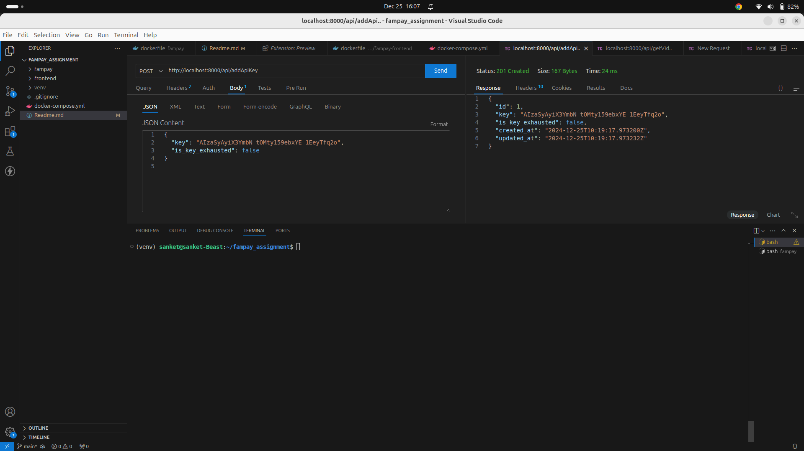
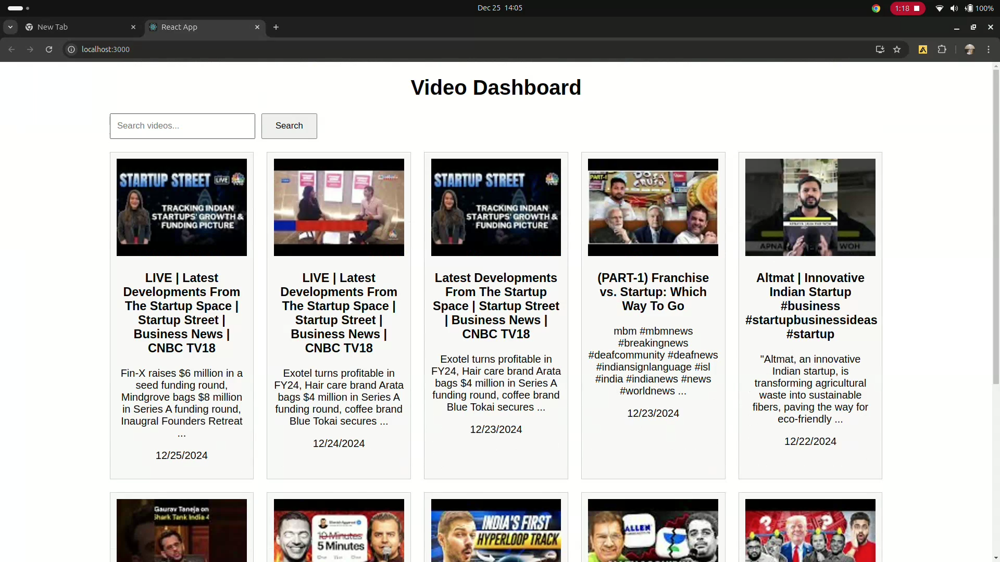
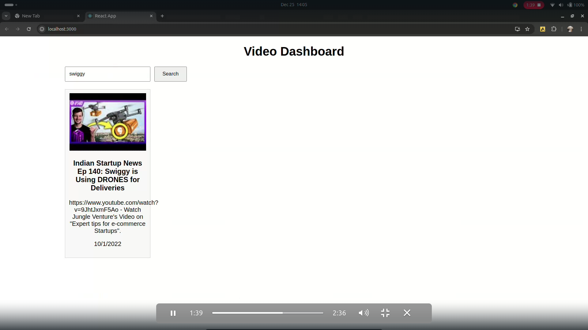

# FamPay-Hiring-Assignment
Backend Assignment (Intern)

<h4> TechStack Used</h4>
1. Python (Programming Language)<br>
2. Django (Web Framework)<br>
3. PGSQL (Database)<br>

[watch video](https://drive.google.com/file/d/1JRrsi1Hsaol7-rcLABlQTyCCLrMgC_Mk/view?usp=sharing)

<video controls width="600">
  <source src="https://drive.google.com/file/d/1JRrsi1Hsaol7-rcLABlQTyCCLrMgC_Mk/view?usp=sharing" type="video/mp4">
</video>


<h5> How to setup and run locally </h5>
<p>
  1. Clone the Repository <br>
</p>

```git clone https://github.com/Sanket-0510/fampay_assignment.git```

change the directory

`cd fampay_assignment`

<p> make sure that you have docker and docker compose intalled on your system </p> 

<h3>run the docker compose file</h3>

  `docker-compose up`

<p> Now you will need to add the Youtube API key to the API key database table 
for that you can use thunderclient or postman and post the API key to the api key table
</p>

Endpoint - `http://localhost:8000/api/addApiKey`




<h2>once the API key is added server will start accumulating the videos from the youtube API</h2>




<h2> you can use search bar to search the videos with keywrods from the database </h2>




